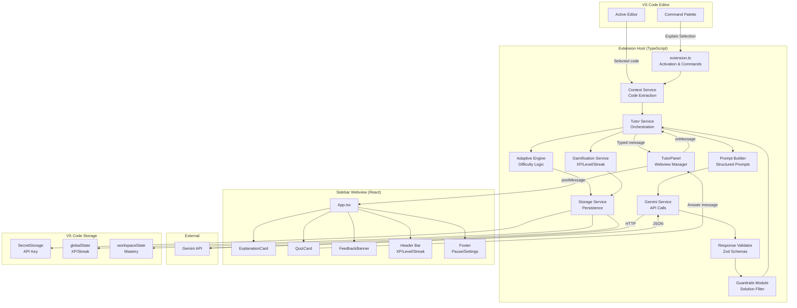
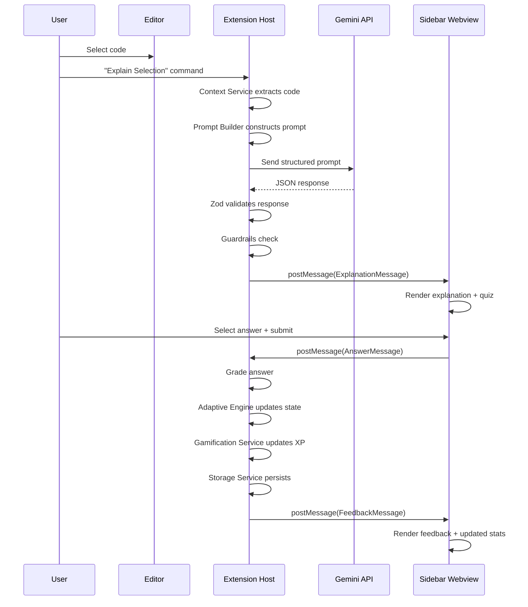

# Design Document: Core Tutor Loop

## Overview

The core tutor loop is the end-to-end learning flow that defines Vybe Tutor's MVP experience. It connects code selection in the VS Code editor to a Gemini-powered explanation, a comprehension quiz, adaptive difficulty adjustment, gamification updates, and local persistence — all rendered in a React sidebar webview.

### Primary Flow

```
Select code → Extract context → Build prompt → Call Gemini → Validate response →
Apply guardrails → Render explanation + quiz → Submit answer → Grade answer →
Update adaptive state → Update XP/streak → Persist state → Ready for next interaction
```

### Design Goals

- **Demo reliability**: Every step must handle failure gracefully so the hackathon demo never crashes.
- **Deterministic local logic**: Difficulty transitions, XP, levels, and streaks are computed locally — Gemini generates content, not decisions.
- **Type safety**: All boundaries (host↔webview, service↔Gemini, storage↔state) use Zod-validated typed payloads.
- **Local-first privacy**: No cloud accounts, no persisted source code, API keys in SecretStorage only.
- **Beginner-friendly UX**: Calm sidebar UI, hints before answers, encouraging feedback.

### Scaffolding Note

The current repository contains a Python/FastAPI scaffold that is not part of the target architecture. The VS Code extension project structure defined in the steering files does not exist yet. Implementation tasks must scaffold the TypeScript extension project (package.json, tsconfig.json, extension entry point, webview build pipeline) before building feature logic.

## Architecture

### System Architecture Diagram



### Layer Responsibilities

| Layer | Responsibility | Key Constraint |
|-------|---------------|----------------|
| **Extension Host** | Activation, command registration, lifecycle | Business logic stays out of `extension.ts` |
| **Context Extraction** | Selected code, language ID, filename, diagnostics | Limited to selection + small window, no full files |
| **AI Orchestration** | Prompt building, Gemini calls, response validation, guardrails | Single Gemini service wrapper; validate before use |
| **Adaptive Learning** | Difficulty transitions, recovery state, mastery scoring | All transitions deterministic and local |
| **Gamification** | XP awards, level calculation, streak tracking | Local computation only; no Gemini involvement |
| **Storage** | Read/write state to VS Code storage APIs | API keys in SecretStorage; no raw code persisted |
| **Webview UI** | Render explanation, quiz, feedback, gamification header | Never calls Gemini; never handles API keys |

### Communication Pattern

The extension host and webview communicate via VS Code's `postMessage` / `onDidReceiveMessage` API. All messages are typed discriminated unions validated with Zod on both sides.



## Components and Interfaces

### 1. Extension Entry Point (`src/extension.ts`)

Registers commands and initializes services on activation.

```ts
// Activation
export function activate(context: vscode.ExtensionContext): void
export function deactivate(): void

// Registered commands:
// - "vybeTutor.explainSelection" → explainSelection command handler
// - "vybeTutor.openPanel" → openTutorPanel command handler
```

### 2. Context Service (`src/services/context.ts`)

Extracts editor context for prompt building.

```ts
interface CodeContext {
  selectedCode: string;
  languageId: string;
  fileName: string;
  diagnostics: string[];
  surroundingCode?: string;
}

function extractCodeContext(editor: vscode.TextEditor): CodeContext
```

**Constraints**: Limits extraction to selected text plus a small surrounding window (≤ 20 lines above/below). Excludes full file contents. Returns diagnostics from the selected range only.

### 3. Tutor Service (`src/services/tutor.ts`)

Orchestrates the full tutor loop. This is the central coordinator.

```ts
interface TutorService {
  startExplanation(context: CodeContext): Promise<void>;
  handleAnswer(answer: string): Promise<void>;
  getPauseState(): boolean;
  setPauseState(paused: boolean): void;
}
```

**Orchestration flow for `startExplanation`**:
1. Check pause state — if paused, do nothing.
2. Look up current ConceptMastery for the concept (if known from prior sessions).
3. Call Prompt Builder with context + current difficulty.
4. Call Gemini Service.
5. Validate response with Response Validator.
6. Apply guardrails.
7. Send validated data to webview via TutorPanel.
8. Award 5 XP for explanation + quiz attempt after quiz is attempted.

**Orchestration flow for `handleAnswer`**:
1. Grade the answer against `correctAnswer`.
2. Call Adaptive Engine to update mastery state.
3. Call Gamification Service to update XP/streak.
4. Persist updated state via Storage Service.
5. Send feedback message to webview.

### 4. Prompt Builder (`src/prompts/`)

Constructs structured prompts for Gemini.

```ts
// src/prompts/explainAndQuiz.ts
function buildExplainAndQuizPrompt(params: {
  code: string;
  languageId: string;
  fileName: string;
  diagnostics: string[];
  concept?: string;
  difficulty: 1 | 2 | 3 | 4 | 5;
}): string

// src/prompts/nextQuestion.ts
function buildNextQuestionPrompt(params: {
  concept: string;
  difficulty: 1 | 2 | 3 | 4 | 5;
  previousQuestion?: string;
  needsHint: boolean;
}): string

// src/prompts/answerFeedback.ts
function buildAnswerFeedbackPrompt(params: {
  question: string;
  userAnswer: string;
  correctAnswer: string;
  concept: string;
}): string
```

**Constraints**: Prompts request JSON output. Prompts include instructions to explain concepts, not provide solutions. Prompts include the current difficulty level so Gemini generates appropriately leveled content.

### 5. Gemini Service (`src/services/gemini.ts`)

Single wrapper for all Gemini API calls.

```ts
interface GeminiService {
  generateContent(prompt: string): Promise<string>;
  isConfigured(): boolean;
}

function createGeminiService(secretStorage: vscode.SecretStorage): GeminiService
```

**Constraints**: All Gemini calls go through this single service. The service retrieves the API key from SecretStorage. Returns raw JSON string for the Response Validator to parse.

### 6. Response Validator (`src/schemas/`)

Zod schemas that validate all Gemini output.

```ts
// src/schemas/tutorResponse.ts
const TutorResponseSchema: z.ZodType<TutorResponse>
function validateTutorResponse(raw: unknown): Result<TutorResponse, ValidationError>

// src/schemas/messages.ts
const HostToWebviewMessageSchema: z.ZodType<HostToWebviewMessage>
const WebviewToHostMessageSchema: z.ZodType<WebviewToHostMessage>

// src/schemas/mastery.ts
const ConceptMasterySchema: z.ZodType<ConceptMastery>

// src/schemas/gamification.ts
const GamificationStateSchema: z.ZodType<GamificationState>
```

**Constraints**: Every Gemini response is validated before use. Validation returns a discriminated result type (success with typed data, or error with details). Invalid responses never reach the webview.

### 7. Guardrails Module (`src/utils/guardrails.ts`)

Checks for solution-like content in Gemini output.

```ts
interface GuardrailResult {
  safe: boolean;
  sanitizedResponse?: TutorResponse;
  reason?: string;
}

function applyGuardrails(response: TutorResponse): GuardrailResult
```

**Behavior**: If `containsSolutionLikeOutput` is true, replaces the explanation with a conceptual hint and logs the reason. Returns the sanitized response for rendering.

### 8. Adaptive Engine (`src/services/adaptiveEngine.ts`)

Deterministic difficulty and mastery state machine.

```ts
interface AdaptiveEngine {
  processAnswer(
    concept: string,
    isCorrect: boolean,
    currentMastery: ConceptMastery
  ): ConceptMastery;
  getInitialMastery(concept: string): ConceptMastery;
}
```

**State transitions** (all deterministic, no Gemini involvement):

| Current State | Event | Next State |
|--------------|-------|------------|
| Stable, any difficulty | Incorrect | Recovering, difficulty max(1, D-1), lastMissedDifficulty = D |
| Recovering, D < lastMissed | Correct | Recovering, difficulty D+1, mastery ↑ |
| Recovering, D ≥ lastMissed | Correct | Stable, needsReview = false, mastery ↑ |
| Stable, < 2 correct in a row | Correct | Stable, mastery ↑, same difficulty |
| Stable, 2+ correct in a row | Correct | Stable, difficulty min(5, D+1), mastery ↑ |
| Any, 2 incorrect in a row | Incorrect | Same concept, difficulty max(1, D-1), hint + simpler |

**Mastery formula**: Mastery is a weighted average where recent answers carry more weight. Correct answers at higher difficulty increase mastery more. Incorrect answers decrease mastery slightly. Range is always [0, 1].

### 9. Gamification Service (`src/services/gamification.ts`)

Local XP, level, and streak computation.

```ts
interface GamificationService {
  awardQuizXp(isCorrect: boolean, isRecovering: boolean): GamificationState;
  awardAttemptXp(): GamificationState;
  updateStreak(): GamificationState;
  getState(): GamificationState;
  loadState(state: GamificationState): void;
}
```

**XP rules**:
- Correct answer: +10 XP
- Explanation + quiz attempt: +5 XP
- Recovery success (correct while recovering): +5 bonus XP
- No XP deduction for incorrect answers

**Level**: `Math.floor(totalXp / 100) + 1`, capped at 10.

**Streak**: Increments by 1 on first quiz completion of a new calendar day. Resets to 1 if more than one calendar day has passed. Preserved if quiz already completed today. Pause does not break an earned streak.

### 10. Storage Service (`src/services/storage.ts`)

Reads and writes state to VS Code storage APIs.

```ts
interface StorageService {
  readMastery(concept: string): Promise<ConceptMastery | null>;
  writeMastery(mastery: ConceptMastery): Promise<void>;
  readAllMastery(): Promise<ConceptMastery[]>;
  readGamification(): Promise<GamificationState>;
  writeGamification(state: GamificationState): Promise<void>;
  readApiKey(): Promise<string | undefined>;
  writeApiKey(key: string): Promise<void>;
}

function createStorageService(context: vscode.ExtensionContext): StorageService
```

**Storage mapping**:
- `globalState`: GamificationState (XP, level, streak — shared across workspaces)
- `workspaceState`: ConceptMastery records (per-workspace learning progress)
- `SecretStorage`: Gemini API key

**Constraints**: Never persists raw code snippets or full files. Initializes defaults on corrupted/missing data. Logs warnings on recovery.

### 11. TutorPanel (`src/panels/TutorPanel.ts`)

Manages the webview panel lifecycle and message routing.

```ts
class TutorPanel {
  static createOrShow(extensionUri: vscode.Uri): TutorPanel;
  postMessage(message: HostToWebviewMessage): void;
  onDidReceiveMessage(handler: (msg: WebviewToHostMessage) => void): void;
  dispose(): void;
}
```

**Constraints**: Validates outgoing messages against `HostToWebviewMessageSchema`. Routes incoming messages to the Tutor Service. Manages webview HTML/JS loading from the bundled React app.

### 12. Webview Components (`webview/src/`)

React components for the sidebar UI.

```
webview/src/
├── App.tsx                    — Root component, message listener, state router
├── components/
│   ├── HeaderBar.tsx          — Logo, level badge, XP bar, streak counter
│   ├── ExplanationCard.tsx    — Summary, concept badge, language, difficulty, key ideas
│   ├── QuizCard.tsx           — Question, answer choices, submit button
│   ├── FeedbackBanner.tsx     — Correct/incorrect, hint, explanation reveal
│   ├── EmptyState.tsx         — Instructions before first session
│   ├── LoadingState.tsx       — Spinner during Gemini call
│   ├── ErrorState.tsx         — Retry prompt on API failure
│   ├── PausedState.tsx        — Paused indicator with resume button
│   └── DifficultyIndicator.tsx — Visual difficulty level
├── hooks/
│   ├── useVSCodeApi.ts        — VS Code webview API wrapper
│   └── useTutorState.ts       — State management for tutor flow
├── state/
│   └── tutorReducer.ts        — Reducer for webview state transitions
└── styles/
    └── index.css              — Tailwind CSS entry point
```

### Host↔Webview Message Types

```ts
// Host → Webview
type HostToWebviewMessage =
  | { type: "explanation"; payload: TutorResponse }
  | { type: "feedback"; payload: FeedbackPayload }
  | { type: "gamificationUpdate"; payload: GamificationState }
  | { type: "error"; payload: { message: string; retryable: boolean } }
  | { type: "loading" }
  | { type: "paused"; payload: { paused: boolean } }
  | { type: "quizRetry"; payload: { message: string } };

// Webview → Host
type WebviewToHostMessage =
  | { type: "submitAnswer"; payload: { answer: string } }
  | { type: "retryExplanation" }
  | { type: "retryQuiz" }
  | { type: "togglePause" }
  | { type: "ready" };

interface FeedbackPayload {
  isCorrect: boolean;
  feedback: string;
  hint?: string;
  correctAnswer?: string;
  explanation?: string;
  shouldRevealAnswer: boolean;
  updatedMastery: { concept: string; mastery: number; difficulty: 1|2|3|4|5; recoveryState: string };
}
```

## Data Models

### ConceptMastery

```ts
type ConceptMastery = {
  concept: string;
  mastery: number;               // 0 to 1
  currentDifficulty: 1 | 2 | 3 | 4 | 5;
  lastDifficulty: 1 | 2 | 3 | 4 | 5;
  lastMissedDifficulty?: 1 | 2 | 3 | 4 | 5;
  recentCorrect: boolean[];      // sliding window of recent answers
  recoveryState: "stable" | "recovering";
  needsReview: boolean;
  updatedAt: string;             // ISO 8601 timestamp
};
```

**Default values** (new concept or corrupted data):
```ts
{
  concept: "<concept>",
  mastery: 0,
  currentDifficulty: 1,
  lastDifficulty: 1,
  lastMissedDifficulty: undefined,
  recentCorrect: [],
  recoveryState: "stable",
  needsReview: false,
  updatedAt: new Date().toISOString()
}
```

### GamificationState

```ts
type GamificationState = {
  totalXp: number;
  level: number;                  // 1 to 10
  currentStreak: number;
  lastQuizDate?: string;          // ISO 8601 date string (YYYY-MM-DD)
  completedQuizDates: string[];   // array of ISO date strings
};
```

**Default values**:
```ts
{
  totalXp: 0,
  level: 1,
  currentStreak: 0,
  lastQuizDate: undefined,
  completedQuizDates: []
}
```

### TutorResponse (Gemini output, validated by Zod)

```ts
type TutorResponse = {
  summary: string;
  language: string;
  concept: string;
  difficulty: 1 | 2 | 3 | 4 | 5;
  explanation: string;
  keyIdeas: string[];
  quiz: {
    question: string;
    choices?: string[];
    correctAnswer: string;
    hint: string;
    explanation: string;
  };
  misconceptions?: string[];
  courseworkConnections?: string[];
  containsSolutionLikeOutput: boolean;
};
```

### AnswerFeedback (Gemini output for free-text grading)

```ts
type AnswerFeedback = {
  isCorrect: boolean;
  feedback: string;
  hint?: string;
  misconception?: string;
  shouldRevealAnswer: boolean;
};
```

### CodeContext (internal, not persisted)

```ts
type CodeContext = {
  selectedCode: string;
  languageId: string;
  fileName: string;
  diagnostics: string[];
  surroundingCode?: string;
};
```

### Storage Schema Summary

| Store | Key Pattern | Value Type | Scope |
|-------|------------|------------|-------|
| `globalState` | `"gamification"` | `GamificationState` | All workspaces |
| `workspaceState` | `"mastery:{concept}"` | `ConceptMastery` | Per workspace |
| `workspaceState` | `"mastery:index"` | `string[]` | Concept name index |
| `SecretStorage` | `"vybeTutor.apiKey"` | `string` | Secure, all workspaces |


## Correctness Properties

*A property is a characteristic or behavior that should hold true across all valid executions of a system — essentially, a formal statement about what the system should do. Properties serve as the bridge between human-readable specifications and machine-verifiable correctness guarantees.*

### Property 1: Context extraction window limit

*For any* file content and any selection range within that file, the Context Service's extracted context SHALL contain only the selected text plus at most the configured surrounding window (≤ 20 lines above/below), and SHALL never include the full file content when the file exceeds the window size.

**Validates: Requirements 1.4**

### Property 2: Prompt builder includes all required fields

*For any* valid CodeContext (with random code, languageId, fileName, diagnostics), any concept string, and any difficulty level 1–5, the prompt string produced by `buildExplainAndQuizPrompt` SHALL contain the selected code, language ID, filename, each diagnostic string, the concept (when provided), and the difficulty level.

**Validates: Requirements 2.1**

### Property 3: Gemini response schema round-trip

*For any* valid TutorResponse object and *for any* valid AnswerFeedback object, serializing the object to JSON with `JSON.stringify`, parsing it back with `JSON.parse`, and validating it against the corresponding Zod schema SHALL produce an object deeply equal to the original.

**Validates: Requirements 2.4, 10.2, 10.3, 10.5**

### Property 4: Invalid Gemini response rejection

*For any* string that is not valid JSON, or any object that is missing required TutorResponse fields or has fields of incorrect types, the Response Validator SHALL return a structured error result (never a valid TutorResponse) containing validation failure details.

**Validates: Requirements 2.5, 10.4**

### Property 5: Message schema round-trip

*For any* valid HostToWebviewMessage and *for any* valid WebviewToHostMessage, serializing the message to JSON and validating it against the corresponding messages Zod schema SHALL produce an equivalent validated message object.

**Validates: Requirements 3.6, 9.1, 9.2**

### Property 6: Invalid message rejection

*For any* object that does not conform to the HostToWebviewMessage or WebviewToHostMessage Zod schemas, validation SHALL fail and the message SHALL be discarded with a logged validation error.

**Validates: Requirements 9.3**

### Property 7: Guardrails sanitize solution-like output

*For any* valid TutorResponse where `containsSolutionLikeOutput` is true, the Guardrails Module SHALL return a result where the explanation content has been replaced with a conceptual hint or guidance, and the `safe` flag reflects the sanitization. *For any* valid TutorResponse where `containsSolutionLikeOutput` is false, the Guardrails Module SHALL return the response unchanged with `safe` set to true.

**Validates: Requirements 2.6**

### Property 8: Answer grading correctness

*For any* answer string and any correctAnswer string, the grading function SHALL return `isCorrect = true` if and only if the submitted answer matches the correct answer (using the defined comparison logic), and `isCorrect = false` otherwise.

**Validates: Requirements 4.2**

### Property 9: Adaptive engine state transitions

*For any* valid ConceptMastery state and any quiz answer (correct or incorrect), the Adaptive Engine's `processAnswer` function SHALL produce a new ConceptMastery state that matches exactly one of the following transition rules:

- **Incorrect while stable**: `recoveryState` becomes "recovering", `currentDifficulty` becomes `max(1, D − 1)`, `lastMissedDifficulty` is set to D, `needsReview` becomes true.
- **Incorrect while recovering (double incorrect)**: `currentDifficulty` decreases by 1 (minimum 1), concept is preserved, hint signal is set.
- **Correct while recovering, D < lastMissedDifficulty**: `currentDifficulty` increases by 1, mastery increases.
- **Correct while recovering, D ≥ lastMissedDifficulty**: `recoveryState` becomes "stable", `needsReview` becomes false, mastery increases.
- **Correct while stable, 2+ correct in a row**: `currentDifficulty` increases by 1 (capped at 5), mastery increases.
- **Correct while stable, < 2 correct in a row**: mastery increases, `currentDifficulty` unchanged.

**Validates: Requirements 5.1, 5.2, 5.3, 5.4, 5.5, 5.6**

### Property 10: Adaptive engine output invariants

*For any* valid ConceptMastery state and any sequence of correct/incorrect answers applied through the Adaptive Engine, the resulting state SHALL always satisfy: `mastery` is in the range [0, 1], and `currentDifficulty` is an integer in the range [1, 5].

**Validates: Requirements 5.7, 5.8**

### Property 11: XP award correctness

*For any* GamificationState and any quiz outcome (correct, incorrect, recovering), the Gamification Service SHALL:
- Add exactly 10 XP for a correct answer.
- Add exactly 5 XP for any explanation + quiz attempt.
- Add exactly 5 bonus XP when the answer is correct and `recoveryState` is "recovering".
- Never decrease `totalXp` for an incorrect answer.

**Validates: Requirements 6.1, 6.2, 6.3, 6.7**

### Property 12: Level calculation

*For any* non-negative integer `totalXp`, the Gamification Service SHALL compute `level` as `Math.floor(totalXp / 100) + 1`, capped at a maximum of 10.

**Validates: Requirements 6.4**

### Property 13: Streak update logic

*For any* GamificationState and any "today" date:
- If `lastQuizDate` equals today, the streak SHALL remain unchanged.
- If `lastQuizDate` equals yesterday, the streak SHALL increment by 1.
- If `lastQuizDate` is more than one day before today (or undefined), the streak SHALL reset to 1.
- Activating pause SHALL not alter the streak when a quiz has already been completed today.

**Validates: Requirements 6.5, 6.6, 8.5**

### Property 14: Corrupted storage recovery

*For any* malformed, corrupted, or missing state data read from VS Code storage, the Storage Service SHALL return valid default state values (mastery 0, XP 0, streak 0, difficulty 1) and the returned state SHALL pass Zod schema validation.

**Validates: Requirements 7.5**

## Error Handling

### Error Categories and Recovery Strategies

| Error | Source | User-Facing Behavior | Internal Behavior |
|-------|--------|---------------------|-------------------|
| No code selected | Context Service | Info message: "Select some code first" | No log needed |
| Gemini API key missing | Gemini Service | Prompt to configure API key | Log warning |
| Gemini network/API error | Gemini Service | Error state with "Retry" button | Log error with details |
| Invalid Gemini JSON | Response Validator | "Something went wrong. Try again?" with retry | Log Zod validation errors |
| Missing quiz fields | Response Validator | Render explanation, show "Retry quiz" button | Log partial response warning |
| Solution-like output | Guardrails Module | Show conceptual hint instead of solution | Log guardrail trigger |
| Invalid host↔webview message | Message layer | Silently discard | Log validation error |
| Corrupted storage data | Storage Service | Transparent reset to defaults | Log warning with corruption details |
| Webview not ready | TutorPanel | Queue message, retry when ready | Log timing issue |

### Error Handling Principles

1. **User-facing errors are friendly and actionable**: Always provide a clear next step (retry, configure, select code).
2. **Internal errors are detailed**: Log Zod paths, HTTP status codes, stack traces for debugging.
3. **Malformed AI output is recoverable**: Never crash on bad Gemini output. Show retry UI.
4. **State corruption is self-healing**: Default to safe initial values rather than throwing.
5. **No silent failures in the demo path**: Every error in the core loop surfaces a visible indicator.

### Retry Strategy

- Gemini API failures: User-initiated retry via button. No automatic retry to avoid rate limiting.
- Quiz generation failures: Separate retry for quiz when explanation succeeded.
- Storage write failures: Retry once silently, then log and continue (state will be re-persisted on next action).

## Testing Strategy

### Testing Framework

- **Vitest** for all unit and property-based tests.
- **fast-check** (via `@fast-check/vitest` or standalone) for property-based testing with Vitest.
- Tests live in `tests/unit/` and `tests/integration/`.

### Dual Testing Approach

**Property-based tests** verify universal correctness properties across randomly generated inputs. Each property test runs a minimum of 100 iterations and references a specific design property.

**Unit tests** verify specific examples, edge cases, integration points, and error conditions. Unit tests complement property tests by covering concrete scenarios and UI behavior.

### Property-Based Test Plan

Each property test must be tagged with a comment referencing the design property:

| Test File | Property | Min Iterations | Tag |
|-----------|----------|---------------|-----|
| `adaptiveEngine.test.ts` | Property 9: Adaptive engine state transitions | 100 | `Feature: core-tutor-loop, Property 9: Adaptive engine state transitions` |
| `adaptiveEngine.test.ts` | Property 10: Adaptive engine output invariants | 100 | `Feature: core-tutor-loop, Property 10: Adaptive engine output invariants` |
| `gamification.test.ts` | Property 11: XP award correctness | 100 | `Feature: core-tutor-loop, Property 11: XP award correctness` |
| `gamification.test.ts` | Property 12: Level calculation | 100 | `Feature: core-tutor-loop, Property 12: Level calculation` |
| `gamification.test.ts` | Property 13: Streak update logic | 100 | `Feature: core-tutor-loop, Property 13: Streak update logic` |
| `tutorResponse.test.ts` | Property 3: Gemini response schema round-trip | 100 | `Feature: core-tutor-loop, Property 3: Gemini response schema round-trip` |
| `tutorResponse.test.ts` | Property 4: Invalid Gemini response rejection | 100 | `Feature: core-tutor-loop, Property 4: Invalid Gemini response rejection` |
| `panelMessaging.test.ts` | Property 5: Message schema round-trip | 100 | `Feature: core-tutor-loop, Property 5: Message schema round-trip` |
| `panelMessaging.test.ts` | Property 6: Invalid message rejection | 100 | `Feature: core-tutor-loop, Property 6: Invalid message rejection` |
| `guardrails.test.ts` | Property 7: Guardrails sanitize solution-like output | 100 | `Feature: core-tutor-loop, Property 7: Guardrails sanitize solution-like output` |
| `context.test.ts` | Property 1: Context extraction window limit | 100 | `Feature: core-tutor-loop, Property 1: Context extraction window limit` |
| `promptBuilder.test.ts` | Property 2: Prompt builder includes all required fields | 100 | `Feature: core-tutor-loop, Property 2: Prompt builder includes all required fields` |
| `grading.test.ts` | Property 8: Answer grading correctness | 100 | `Feature: core-tutor-loop, Property 8: Answer grading correctness` |
| `storage.test.ts` | Property 14: Corrupted storage recovery | 100 | `Feature: core-tutor-loop, Property 14: Corrupted storage recovery` |

### Unit Test Plan

| Test File | Coverage Area | Key Scenarios |
|-----------|--------------|---------------|
| `adaptiveEngine.test.ts` | Specific transition examples | New concept defaults, boundary difficulty (1 and 5), recovery completion |
| `gamification.test.ts` | Specific XP/streak examples | Zero XP start, level cap at 10, streak reset after gap, same-day no-op |
| `tutorResponse.test.ts` | Schema edge cases | Missing optional fields, extra fields stripped, empty keyIdeas array |
| `storage.test.ts` | Storage integration | Read/write round-trip with mock VS Code API, missing key returns default |
| `panelMessaging.test.ts` | Message examples | Each message type serializes correctly, unknown type rejected |
| `guardrails.test.ts` | Guardrail examples | Solution-like flag true/false, sanitized output structure |
| `context.test.ts` | Context extraction | No selection returns error, diagnostics from selection range only |
| `tutor.test.ts` | Orchestration flow | Full loop with mocked services, pause suppresses generation, error propagation |
| `gemini.test.ts` | API integration | Mock successful call, mock network error, mock invalid response |

### Integration Test Plan

| Test | What It Verifies |
|------|-----------------|
| Full tutor loop | Select code → explanation → quiz → answer → feedback → state update → persistence |
| Error recovery | Gemini failure → retry → success → normal flow continues |
| Pause/resume | Pause suppresses generation, resume allows next action |
| Storage reload | Persist state, simulate reload, verify state restored |

### Test Data

- Deterministic demo snippets in `src/test-data/snippets/` for reproducible integration tests.
- `fast-check` arbitraries for generating random ConceptMastery, GamificationState, TutorResponse, and message objects.
- All Gemini calls mocked in automated tests — no live API calls.
