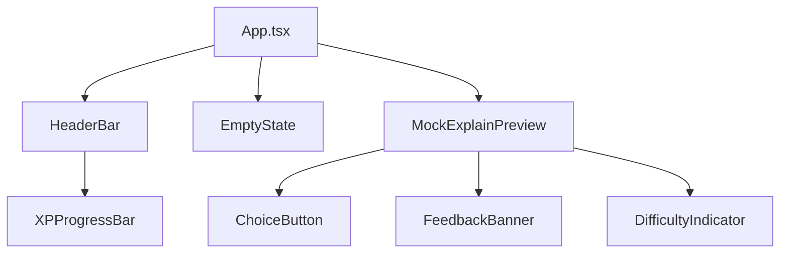

# Design Document: Stage 05 — UI Polish

## Overview

This design covers a cosmetic and UX refinement pass on the Vybe Tutor sidebar webview. The goal is to improve visual hierarchy, readability, and color consistency across the existing component set without introducing new product features or altering extension host logic.

All changes are scoped to the `webview/` directory. The existing game loop (answer selection, XP, combo, recovery mode, difficulty adjustment, Try Easier Question flow) remains functionally unchanged. The primary deliverables are:

1. Register missing CSS custom properties so components stop relying on browser fallbacks.
2. Formalize semantic color roles with explicit mappings:
   - **Amber**: XP, active state, correct answer, selected answer, primary buttons, LIVE status.
   - **Red**: incorrect answer, recovery/error border, "Not quite" heading.
   - **Gray**: metadata, disabled answer text, dividers, inactive labels.
   - **Off-white**: primary reading text and explanation copy.
3. Improve typography hierarchy with an explicit size scale:
   - Header/logo: 14–16px, letter-spaced.
   - Metadata: 11–12px.
   - Concept title: 14–16px.
   - Explanation body: 18–20px.
   - Question text: 18–20px.
   - Answer choices: 16–18px.
   - Feedback body: 16–18px.
   - Buttons: 16–18px.
4. Simplify the HeaderBar layout to reduce crowding.
5. Reduce emoji visual weight.
6. Improve disabled ChoiceButton readability.
7. Restructure FeedbackBanner for correct and incorrect states with clear visual hierarchy.
8. Add a "Next Challenge" button for the correct-answer flow.
9. Preserve keyboard accessibility on all interactive elements.

### Scope Boundaries

- **In scope**: CSS variables, Tailwind classes, component JSX structure, component props within `webview/`.
- **Out of scope**: Gemini integration, storage persistence, adaptive engine logic, file import, deep dive, new product features, extension host changes (unless strictly required for a read-only UI state prop).

---

## Architecture

The UI polish pass does not change the application architecture. The existing data flow remains:

```
Extension Host → postMessage → App.tsx → MockExplainPreview → [ChoiceButton, FeedbackBanner, DifficultyIndicator]
                                       → HeaderBar → XPProgressBar
```

### Component Dependency Graph



### Change Strategy

Changes are organized into three layers:

1. **Foundation layer** — CSS custom properties in `index.css` and Tailwind config in `tailwind.config.js`. This is done first so all components can reference the updated token set.
2. **Component layer** — JSX and class changes in individual `.tsx` files. Each component is updated independently.
3. **Verification layer** — Manual visual review and example-based tests to confirm no regressions.

No new components are introduced. No components are removed. The existing component interfaces (props) remain backward-compatible, with one addition: the FeedbackBanner's `onContinue` callback now renders a button labeled "Next Challenge" instead of "Continue".

---

## Components and Interfaces

### 1. CSS Variable System (`webview/src/styles/index.css`)

**Current state**: The `:root` block defines 10 variables. Three variables referenced by components are missing: `--vybe-panel-raised`, `--vybe-amber-dark`, and `--vybe-chip-bg`.

**Changes**:

Add the missing variables and introduce two new semantic variables for red tones:

```css
:root {
  /* Existing — unchanged */
  --vybe-bg: var(--vscode-sideBar-background, #202020);
  --vybe-panel: #242424;
  --vybe-raised: #2a2a2a;
  --vybe-text: var(--vscode-foreground, #f2f2f2);
  --vybe-muted: #a8a8a8;
  --vybe-subtle: #737373;
  --vybe-border: rgba(255, 255, 255, 0.10);
  --vybe-amber: #d6ad45;
  --vybe-chip: #181818;
  --vybe-mono: ui-monospace, SFMono-Regular, Menlo, Monaco, Consolas,
    "Liberation Mono", monospace;

  /* New — previously referenced but undefined */
  --vybe-panel-raised: #2e2e2e;
  --vybe-amber-dark: #3d2e0a;
  --vybe-chip-bg: #1a1a1a;

  /* New — semantic red for incorrect/recovery */
  --vybe-red: #e05252;
  --vybe-red-dark: #3a1616;
}
```

**Rationale**: Components like `HeaderBar`, `ChoiceButton`, and `XPProgressBar` already reference `--vybe-panel-raised`, `--vybe-amber-dark`, and `--vybe-chip-bg`. Without definitions, browsers fall back to `initial` (transparent or black), causing invisible elements. The red variables formalize the incorrect/recovery color role that currently uses raw Tailwind `red-400`/`red-500` classes.

### 2. Tailwind Config (`webview/tailwind.config.js`)

**Changes**: Add the new color tokens so components can use `text-vybe-red`, `bg-vybe-red-dark`, etc.:

```js
colors: {
  vybe: {
    bg: "var(--vybe-bg)",
    panel: "var(--vybe-panel)",
    raised: "var(--vybe-raised)",
    "panel-raised": "var(--vybe-panel-raised)",   // new
    text: "var(--vybe-text)",
    muted: "var(--vybe-muted)",
    subtle: "var(--vybe-subtle)",
    border: "var(--vybe-border)",
    amber: "var(--vybe-amber)",
    "amber-dark": "var(--vybe-amber-dark)",       // new
    chip: "var(--vybe-chip)",
    "chip-bg": "var(--vybe-chip-bg)",             // new
    red: "var(--vybe-red)",                       // new
    "red-dark": "var(--vybe-red-dark)",           // new
  },
},
```

**Rationale**: Using Tailwind tokens instead of inline `var()` references keeps class names consistent and enables Tailwind's opacity modifier syntax (e.g., `bg-vybe-red/10`).

### 3. HeaderBar (`webview/src/components/HeaderBar.tsx`)

**Current issues**: The top row packs the title, streak emoji, and status pill on one line. The fire emoji (🔥) is visually loud.

**Changes**:

- Keep the top row to two elements: product title (left) and status pill (right).
- Move the streak indicator into the XP bar row, positioned to the left of the level badge, at reduced visual weight (smaller size, reduced opacity).
- The XPProgressBar remains on its own row below the title row (already the case).
- Reduce streak emoji size to `text-[9px]` and apply `opacity-70` so it doesn't compete with the title.

**Preferred layout**:

```
┌─────────────────────────────────────┐
│ VYBE EXPLAIN                  LIVE  │  ← title row (2 elements only)
│ LV1  ████████░░░  40/100 XP        │  ← XP row
│ STREAK 1                            │  ← streak as quiet text label
└─────────────────────────────────────┘
```

**Alternative compact layout** (if vertical space is tight):

```
┌──────────────────────────────────────────────────┐
│ VYBE EXPLAIN   LV1   40/100 XP   STREAK 1   LIVE│
└──────────────────────────────────────────────────┘
```

**Emoji rule**: Either remove the flame emoji entirely and use plain `STREAK 1` text, or keep the flame but render it smaller and visually quieter (e.g., `text-[9px] opacity-70`). Do not add emoji elsewhere.

**Props**: No changes to `HeaderBarProps`. The `gameState.streak` is already available. The streak display moves from HeaderBar's title row into the XP bar row area. Implementation approach:
- (a) Pass `streak` as a prop to `XPProgressBar`, or
- (b) Render the streak inline in HeaderBar's XP row wrapper, outside the `XPProgressBar` component.

Option (b) is simpler and avoids changing `XPProgressBar`'s interface. The streak `<span>` moves from the title `<div>` to the XP row `<div>` that wraps `<XPProgressBar>`.

**All-caps rule**: Keep all-caps for `VYBE EXPLAIN`, `LIVE`, `IDLE`, and short game labels like `RECOVERY MODE`. Avoid all-caps for long instructional labels.

### 4. ChoiceButton (`webview/src/components/ChoiceButton.tsx`)

**Current issue**: The `disabled` state applies `opacity-50` to the entire button, making text nearly invisible on the dark background.

**Changes**:

- Remove `opacity-50` from the disabled state class.
- Use `text-vybe-muted` for disabled text instead, which provides legible contrast (~#a8a8a8 on ~#242424 background ≈ 5.3:1 contrast ratio).
- Keep `cursor-default` and `border-vybe-border` for the disabled state.
- Ensure `disabled` and `aria-disabled` attributes remain set for assistive technology.

**Updated disabled state classes**:

```
'bg-vybe-panel border-vybe-border text-vybe-muted cursor-default'
```

### 5. FeedbackBanner (`webview/src/components/FeedbackBanner.tsx`)

This component gets the most structural changes. The correct and incorrect branches are restructured for clearer visual hierarchy.

#### Correct Answer State

**Visual hierarchy** (top to bottom):

1. **Heading row**: "✓ Correct!" in amber, bold, `text-base` with "+10 XP" as inline metadata.
2. **Metadata row**: "Combo x3 · Challenge cleared" in `text-xs`, `text-vybe-muted`.
3. **Explanation**: Quiz explanation in `text-sm` (16px), `text-vybe-muted`, `leading-relaxed`.
4. **Primary CTA**: "Next Challenge" button — full-width, amber border, amber text, `font-bold`, 16–18px.
5. **Optional secondary**: "Why does this work?" link/button for future deep-dive (placeholder, not wired).

```
┌─────────────────────────────────────┐
│ ✓ Correct!          +10 XP         │  ← amber, bold, text-base
│ Combo x3 · Challenge cleared       │  ← muted, text-xs
│                                     │
│ The async keyword marks a function  │  ← muted, text-sm, relaxed
│ as asynchronous...                  │
│                                     │
│ ┌─────────────────────────────────┐ │
│ │        Next Challenge           │ │  ← amber border, bold, 16–18px
│ └─────────────────────────────────┘ │
│ ┌─────────────────────────────────┐ │
│ │     Why does this work?         │ │  ← subtle border, muted text
│ └─────────────────────────────────┘ │
└─────────────────────────────────────┘
```

**Design decisions**:
- The checkmark (✓) is kept as a text character alongside "Correct!" to provide a non-color indicator of success (accessibility).
- The "Next Challenge" button uses `border-vybe-amber` with a subtle `bg-vybe-amber-dark/30` fill, matching the existing style but with the updated label.
- "Why does this work?" is a secondary button placeholder for future deep-dive. It renders as a subtle bordered button but does not wire to any logic in this polish pass.

#### Incorrect Answer State

**Visual hierarchy** (top to bottom):

1. **Heading row**: "× Not quite" in red, bold, `text-base` with "+5 XP" as inline metadata.
2. **Recovery badge** (conditional): "RECOVERY MODE" pill in red tones, `text-[10px]`, all-caps.
3. **Difficulty change** (conditional): "Medium → Easy" in `text-[10px]`, `text-vybe-subtle`.
4. **Hint**: Hint text in `text-sm` (16px), `text-vybe-text` — promoted from `text-xs` for readability. "Hint:" label prefix in `text-vybe-amber`.
5. **Secondary CTA**: "Try Easier Question" button — full-width, `border-vybe-border`, `text-vybe-text`, 16–18px, with hover state transitioning to amber.
6. **Collapsible**: "Review Explanation" details element (unchanged behavior).

```
┌─────────────────────────────────────┐
│ × Not quite          +5 XP         │  ← red, bold, text-base
│                                     │
│ RECOVERY MODE                       │  ← red pill, text-[10px]
│ Medium → Easy                       │  ← subtle, text-[10px]
│                                     │
│ Hint: The decorator remembers what  │  ← amber label, text-sm
│ it already computed.                │
│                                     │
│ ┌─────────────────────────────────┐ │
│ │      Try Easier Question        │ │  ← border, text-vybe-text, 16–18px
│ └─────────────────────────────────┘ │
│ ┌─────────────────────────────────┐ │
│ │      Review Explanation         │ │  ← subtle border, muted text
│ └─────────────────────────────────┘ │
└─────────────────────────────────────┘
```

**Design decisions**:
- The cross (×) is kept as a text character alongside "Not quite" to provide a non-color indicator of failure (accessibility).
- Hint text is promoted to `text-sm` (16px) and uses `--vybe-text` color so it's the most readable element after the heading.
- The "Hint:" label prefix uses `text-vybe-amber` to draw the eye.
- Red tones use the new `--vybe-red` and `--vybe-red-dark` CSS variables instead of raw Tailwind `red-400`/`red-500`.
- "Review Explanation" is rendered as a button instead of a `<details>` collapsible, for visual consistency with the correct card's secondary action.

#### Props

No changes to `FeedbackBannerProps`. The `onContinue` callback already exists and will render the "Next Challenge" button. The `onTryEasier` callback already exists.

### Typography Scale

The following size scale applies across all components. Sizes use Tailwind utility classes mapped to the target pixel ranges:

| Element | Target Size | Tailwind Class | Color |
|---------|------------|----------------|-------|
| Header/logo (`VYBE EXPLAIN`) | 14–16px | `text-sm` / `text-base` | `text-vybe-text` |
| Metadata (line ref, difficulty, XP counts) | 11–12px | `text-[11px]` / `text-xs` | `text-vybe-muted` or `text-vybe-subtle` |
| Concept title | 14–16px | `text-sm` / `text-base` | `text-vybe-amber` |
| Explanation body | 18–20px | `text-lg` | `text-vybe-text` |
| Question text | 18–20px | `text-lg` | `text-vybe-text` |
| Answer choices | 16–18px | `text-base` | `text-vybe-text` |
| Feedback body (hint, explanation) | 16–18px | `text-base` | `text-vybe-text` / `text-vybe-muted` |
| Buttons (Next Challenge, Try Easier) | 16–18px | `text-base` | amber or text |
| Section labels (`QUICK CHECK · +10 XP`) | 11–12px | `text-[11px]` | `text-vybe-subtle`, uppercase, bold, letter-spaced |
| Game labels (`RECOVERY MODE`, `LIVE`) | 10–11px | `text-[10px]` | contextual (amber/red), uppercase, bold |

**All-caps rule**: Use all-caps only for `VYBE EXPLAIN`, `LIVE`, `IDLE`, `RECOVERY MODE`, and short game labels. Avoid all-caps for long instructional labels or hint text.

### 6. MockExplainPreview (`webview/src/components/MockExplainPreview.tsx`)

**Changes**:

- The `handleContinue` function (triggered by the "Next Challenge" button) remains identical in behavior — it calls `getNextQuestion` at the current or higher difficulty.
- The `handleTryEasier` function remains identical.
- **Typography updates**: Explanation body text increases from `text-sm` to `text-lg` (18px). Question text increases from `text-sm` to `text-lg` (18px). Section label "QUICK CHECK · +10 XP" stays at `text-[11px]` uppercase. Line reference metadata stays at `text-xs`.
- No structural changes to the component's JSX beyond class name and size updates.

### 7. XPProgressBar (`webview/src/components/XPProgressBar.tsx`)

**Changes**: Minor — replace any inline `var()` references with Tailwind token equivalents where the config now supports them (e.g., `bg-[var(--vybe-chip-bg)]` becomes `bg-vybe-chip-bg`). No structural changes.

### 8. DifficultyIndicator (`webview/src/components/DifficultyIndicator.tsx`)

**Changes**: No structural changes. Verify it uses `--vybe-subtle` and `--vybe-muted` consistently.

### 9. EmptyState (`webview/src/components/EmptyState.tsx`)

**Changes**: No changes needed. Already uses `text-vybe-muted` and `text-vybe-amber` correctly.

### 10. App.tsx

**Changes**: No changes. The root layout classes remain the same.

---

## Data Models

No data model changes. The existing interfaces remain unchanged:

- `GameState` — tracks XP, level, streak, combo, difficulty, recovery mode.
- `QuizData` — question, choices, correctAnswerIndex, hint, explanation.
- `MockExplanationData` — concept, lineReference, explanation, codeTokens, quiz.
- `FeedbackBannerProps` — isCorrect, hint, xpAwarded, combo, isRecovering, difficultyChange, quizExplanation, onContinue, onTryEasier.
- `ChoiceButtonProps` — label, text, state, onClick.

The `ChoiceState` type (`'default' | 'correct' | 'incorrect' | 'disabled'`) is unchanged.

---

## Error Handling

This UI polish pass does not introduce new error states or failure modes. The existing error handling remains:

- **Missing CSS variables**: Resolved by this design — all referenced variables will have explicit definitions.
- **Missing quiz data**: `getNextQuestion` returns `null` when no questions match; the UI already handles this by not rendering a new question.
- **Keyboard navigation**: Disabled buttons already set `disabled` and `aria-disabled` attributes, which screen readers and keyboard navigation respect.

No new error boundaries, try/catch blocks, or fallback UI are needed.

---

## Testing Strategy

### PBT Applicability Assessment

Property-based testing is **not applicable** to this feature. The changes are entirely:
- CSS custom property definitions (static configuration)
- Tailwind class name updates (UI rendering)
- JSX structure adjustments (UI layout)
- Button label text changes (UI copy)

None of these involve pure functions with varying input spaces, data transformations, parsers, serializers, or algorithmic logic. The acceptance criteria are all verifiable through example-based tests, smoke tests, or manual visual review.

### Unit Tests (Example-Based)

Use **Vitest** with **React Testing Library** for component tests. Focus on:

| Test | Validates |
|------|-----------|
| ChoiceButton disabled state renders legible text without `opacity-50` | Req 6.1, 6.2 |
| ChoiceButton disabled state has `disabled` and `aria-disabled` attributes | Req 9.5, 10.4 |
| ChoiceButton default state is focusable (not disabled) | Req 10.1 |
| FeedbackBanner correct state renders "Correct" heading | Req 7.1 |
| FeedbackBanner correct state renders XP and combo metadata | Req 7.2 |
| FeedbackBanner correct state renders explanation text | Req 7.3 |
| FeedbackBanner correct state renders "Next Challenge" button when onContinue provided | Req 7.4 |
| FeedbackBanner incorrect state renders "Not quite" heading | Req 8.1 |
| FeedbackBanner incorrect state renders hint text | Req 8.2 |
| FeedbackBanner incorrect state renders "RECOVERY MODE" badge when isRecovering | Req 8.3 |
| FeedbackBanner incorrect state renders "Try Easier Question" button when onTryEasier provided | Req 8.5 |
| HeaderBar renders product title and status pill on the same row | Req 4.1, 4.2 |
| HeaderBar renders streak indicator when streak > 0 | Req 4.3 |
| "Next Challenge" button is keyboard-focusable | Req 10.2 |
| "Try Easier Question" button is keyboard-focusable | Req 10.3 |

### Smoke Tests

| Test | Validates |
|------|-----------|
| CSS file defines `--vybe-panel-raised`, `--vybe-amber-dark`, `--vybe-chip-bg` | Req 1.1 |
| All `--vybe-*` variables referenced in components are defined in `:root` | Req 1.2 |

### Regression / Integration Tests

| Test | Validates |
|------|-----------|
| Clicking a correct answer calls `processCorrectAnswer` and updates game state | Req 9.1 |
| Clicking "Next Challenge" loads a new question | Req 9.3 |
| Clicking "Try Easier Question" loads a new question at lower difficulty | Req 9.2 |
| Full answer flow: correct → XP increases, combo increments, difficulty may increase | Req 9.4 |
| Full answer flow: incorrect → XP increases (5), combo resets, recovery mode activates | Req 9.4 |

### Manual Visual Review

The following requirements are best verified through manual inspection in the VS Code sidebar:

- Semantic color roles (Req 2.1–2.5)
- Typography hierarchy (Req 3.1–3.4)
- Header layout simplification (Req 4.4, 4.5)
- Emoji visual weight reduction (Req 5.1, 5.2)
- Dark terminal aesthetic (Req 2.5)
- No new image assets (Req 12.1, 12.2)
- Changes scoped to webview/ only (Req 11.1–11.3)

### Test Runner

- **Vitest** with `--run` flag for single execution (no watch mode).
- **React Testing Library** for component rendering and DOM assertions.
- **fast-check** is not used for this feature (PBT not applicable).
