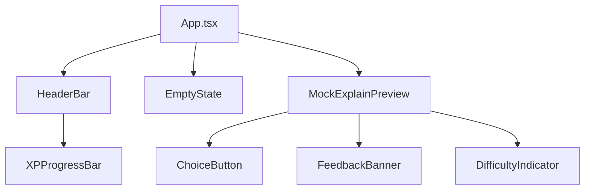

# Design Document: Stage 06 — Cal Poly Theme

## Overview

Stage 6 replaces the current charcoal-and-amber color system with a Cal Poly / Mustangs-inspired palette of greens and golds. The goal is to blend campus identity energy with the existing dark IDE terminal aesthetic — not to make the sidebar look like a university website.

All changes are scoped to the `webview/` directory. The existing component set (`HeaderBar`, `ChoiceButton`, `FeedbackBanner`, `MockExplainPreview`, `XPProgressBar`, `DifficultyIndicator`, `EmptyState`) is unchanged structurally. No new components are introduced. No logic, game state, adaptive engine, or extension host code is modified.

The deliverables are:

1. Replace the CSS custom property palette in `webview/src/styles/index.css` with Cal Poly-inspired tokens.
2. Update the Tailwind config in `webview/tailwind.config.js` to expose the new token set.
3. Update class names across component files to reference the new tokens.
4. Ensure color roles are applied consistently: gold for emphasis/XP/progress, green for success/panels/backgrounds, red reserved for errors only.

### Scope Boundaries

- **In scope**: CSS variables, Tailwind config tokens, class name updates in component `.tsx` files within `webview/`.
- **Out of scope**: Gemini integration, storage persistence, adaptive engine logic, game state logic, extension host changes, new components, structural JSX changes.

---

## Architecture

The architecture is unchanged from Stage 5. This is a token-and-class-name pass only.

```
Extension Host → postMessage → App.tsx → MockExplainPreview → [ChoiceButton, FeedbackBanner, DifficultyIndicator]
                                       → HeaderBar → XPProgressBar
```

### Component Dependency Graph



### Change Strategy

Changes are organized into two layers:

1. **Foundation layer** — Replace CSS custom properties in `index.css` and update Tailwind color config in `tailwind.config.js`. This is done first so all components can reference the new token set.
2. **Component layer** — Update class names in individual `.tsx` files to use the new tokens. Each component is updated independently. No structural JSX changes.

---

## Components and Interfaces

### 1. CSS Variable System (`webview/src/styles/index.css`)

**Current state**: The `:root` block defines a charcoal/amber palette with variables like `--vybe-bg: #202020`, `--vybe-amber: #d6ad45`, etc.

**Changes**: Replace the entire `:root` block with the Cal Poly-inspired palette. The variable names shift from generic neutrals to green-tinted neutrals, and amber is replaced by a richer gold family.

```css
:root {
  /* Cal Poly inspired */
  --vybe-poly-green: #154734;
  --vybe-mustang-gold: #BD8B13;
  --vybe-stadium-gold: #F8E08E;
  --vybe-poly-canyon: #F2C75C;
  --vybe-farmers-green: #3A913F;
  --vybe-dexter-green: #A4D65E;

  /* Neutrals — green-tinted darks */
  --vybe-bg: #101713;
  --vybe-panel: #17231d;
  --vybe-panel-2: #1d2b24;
  --vybe-card: #171b19;
  --vybe-card-raised: #202820;
  --vybe-border: #345244;
  --vybe-border-muted: #2a342f;
  --vybe-text: #f1eadb;
  --vybe-muted: #9d9a8f;

  /* Status */
  --vybe-success: #A4D65E;
  --vybe-success-deep: #3A913F;
  --vybe-warning: #F2C75C;
  --vybe-error: #ff6b6b;
  --vybe-error-bg: #2b2026;

  /* Preserved utility */
  --vybe-mono: ui-monospace, SFMono-Regular, Menlo, Monaco, Consolas,
    "Liberation Mono", monospace;
}
```

**Rationale**: The new palette shifts backgrounds from pure charcoal (#202020, #242424) to near-black greens (#101713, #17231d). Gold replaces amber as the primary accent. Status colors are explicit. The `--vybe-mono` font stack is preserved unchanged.

**Migration mapping** (old → new):

| Old Variable | New Variable | Notes |
|---|---|---|
| `--vybe-bg` (#202020) | `--vybe-bg` (#101713) | Green-black instead of charcoal |
| `--vybe-panel` (#242424) | `--vybe-panel` (#17231d) | Deep green panel |
| `--vybe-raised` (#2a2a2a) | `--vybe-card-raised` (#202820) | Renamed for clarity |
| `--vybe-panel-raised` (#2e2e2e) | `--vybe-panel-2` (#1d2b24) | Secondary panel depth |
| `--vybe-text` (#f2f2f2) | `--vybe-text` (#f1eadb) | Warm off-white instead of cool white |
| `--vybe-muted` (#a8a8a8) | `--vybe-muted` (#9d9a8f) | Warm gray instead of cool gray |
| `--vybe-subtle` (#737373) | Removed | Use `--vybe-muted` or `--vybe-border-muted` |
| `--vybe-border` (rgba white 10%) | `--vybe-border` (#345244) | Green-tinted border |
| `--vybe-amber` (#d6ad45) | `--vybe-mustang-gold` (#BD8B13) | Primary accent shifts to gold |
| `--vybe-amber-dark` (#3d2e0a) | `--vybe-poly-green` (#154734) | Dark accent background |
| `--vybe-chip` (#181818) | `--vybe-card` (#171b19) | Code chip background |
| `--vybe-chip-bg` (#1a1a1a) | `--vybe-card` (#171b19) | Consolidated with card |
| `--vybe-red` (#e05252) | `--vybe-error` (#ff6b6b) | Error red |
| `--vybe-red-dark` (#3a1616) | `--vybe-error-bg` (#2b2026) | Error background |

### 2. Tailwind Config (`webview/tailwind.config.js`)

**Changes**: Replace the color token map to expose the full Cal Poly palette:

```js
colors: {
  vybe: {
    bg: "var(--vybe-bg)",
    panel: "var(--vybe-panel)",
    "panel-2": "var(--vybe-panel-2)",
    card: "var(--vybe-card)",
    "card-raised": "var(--vybe-card-raised)",
    text: "var(--vybe-text)",
    muted: "var(--vybe-muted)",
    border: "var(--vybe-border)",
    "border-muted": "var(--vybe-border-muted)",
    // Cal Poly accents
    "poly-green": "var(--vybe-poly-green)",
    "mustang-gold": "var(--vybe-mustang-gold)",
    "stadium-gold": "var(--vybe-stadium-gold)",
    "poly-canyon": "var(--vybe-poly-canyon)",
    "farmers-green": "var(--vybe-farmers-green)",
    "dexter-green": "var(--vybe-dexter-green)",
    // Status
    success: "var(--vybe-success)",
    "success-deep": "var(--vybe-success-deep)",
    warning: "var(--vybe-warning)",
    error: "var(--vybe-error)",
    "error-bg": "var(--vybe-error-bg)",
  },
},
```

**Rationale**: Every CSS variable gets a Tailwind token so components use `text-vybe-mustang-gold` instead of `text-[var(--vybe-mustang-gold)]`. This enables Tailwind's opacity modifier syntax and keeps class names consistent.

### 3. HeaderBar (`webview/src/components/HeaderBar.tsx`)

**Changes**: Class name updates only. No structural changes.

- Header background: `bg-[var(--vybe-panel)]` → `bg-vybe-panel` (same variable, Tailwind token syntax).
- Border: `border-[var(--vybe-border)]` → `border-vybe-border`.
- Title text: `text-[var(--vybe-text)]` → `text-vybe-text`.
- Streak text: `text-[var(--vybe-amber)]` → `text-vybe-stadium-gold` with `opacity-70` to keep it quiet.
- LIVE badge active: `bg-[var(--vybe-amber-dark)] text-[var(--vybe-amber)]` → `bg-vybe-poly-green text-vybe-mustang-gold`.
- IDLE badge: `bg-[var(--vybe-panel-raised)] text-[var(--vybe-subtle)]` → `bg-vybe-panel-2 text-vybe-muted`.

**Preferred header layout** (unchanged structure):

```
┌─────────────────────────────────────┐
│ VYBE EXPLAIN                  LIVE  │
│ LV1  ████████░░░  40/100 XP        │
│ 🔥 1                                │  ← quiet streak
└─────────────────────────────────────┘
```

- Deep green/black background.
- Mustang Gold for progress fill.
- Stadium Gold for small text accents (streak, XP count).
- Muted gray for secondary labels.

### 4. XPProgressBar (`webview/src/components/XPProgressBar.tsx`)

**Changes**: Class name updates for the Cal Poly color scheme.

- Container background: `bg-[var(--vybe-panel)]` → `bg-vybe-panel`.
- Level label: `text-[var(--vybe-amber)]` → `text-vybe-mustang-gold`.
- Track background: `bg-[var(--vybe-chip-bg)]` → `bg-vybe-poly-green` (green track).
- Fill bar: `bg-[var(--vybe-amber)]` → `bg-vybe-mustang-gold` (gold fill on green track).
- XP text: `text-[var(--vybe-muted)]` → `text-vybe-muted`.

**Result**: Gold fill on a green track, matching the Cal Poly color direction.

### 5. ChoiceButton (`webview/src/components/ChoiceButton.tsx`)

**Changes**: Update state classes to use Cal Poly tokens.

| State | Current | New |
|---|---|---|
| **Default** | `bg-[var(--vybe-panel)] border-[var(--vybe-border)] text-[var(--vybe-text)]` | `bg-vybe-card border-vybe-border-muted text-vybe-text` |
| **Default hover** | `hover:border-[var(--vybe-amber)] hover:bg-[var(--vybe-panel-raised)]` | `hover:border-vybe-mustang-gold hover:bg-vybe-card-raised` with subtle gold glow via `hover:shadow-[0_0_6px_rgba(189,139,19,0.15)]` |
| **Correct** | `bg-[var(--vybe-panel-raised)] border-[var(--vybe-amber)] text-[var(--vybe-amber)]` | `bg-vybe-card-raised border-vybe-dexter-green text-vybe-stadium-gold` |
| **Incorrect** | `border-red-500/50 text-red-400` | `border-vybe-error/50 text-vybe-error` |
| **Disabled** | `text-[var(--vybe-subtle)] opacity-50` | `text-vybe-muted opacity-55 border-vybe-border-muted` (no full opacity-50 washout; text stays readable) |

**Letter label hover**: The letter circle (`A`, `B`, `C`, `D`) uses `border-current`, so it inherits the gold color on hover automatically.

**No layout shift**: Hover adds a subtle box-shadow glow, not a border-width change.

### 6. FeedbackBanner (`webview/src/components/FeedbackBanner.tsx`)

**Changes**: Class name updates to shift from amber/red to green/gold/red.

#### Correct Answer State

```
┌─────────────────────────────────────┐
│ ✓ Correct!          +10 XP         │  ← Mustang Gold, bold
│ Combo x3 · Challenge cleared       │  ← muted, text-xs
│                                     │
│ The async keyword marks a function  │  ← muted, text-sm, relaxed
│ as asynchronous...                  │
│                                     │
│ ┌─────────────────────────────────┐ │
│ │        Next Challenge           │ │  ← gold border, bold
│ └─────────────────────────────────┘ │
└─────────────────────────────────────┘
```

- Card border: `border-[var(--vybe-amber)]/30` → `border-vybe-success-deep/40` (green success border).
- Card background: `bg-[var(--vybe-amber-dark)]/20` → `bg-vybe-poly-green/20` (deep green card).
- Heading "✓ Correct!": `text-[var(--vybe-amber)]` → `text-vybe-mustang-gold`.
- XP text: `text-[var(--vybe-amber)]` → `text-vybe-stadium-gold`.
- Combo text: `text-[var(--vybe-amber)]` → `text-vybe-poly-canyon`.
- Explanation: `text-[var(--vybe-muted)]` → `text-vybe-muted` (unchanged value).
- "Next Challenge" button: `border-[var(--vybe-amber)] bg-[var(--vybe-amber-dark)]/30 text-[var(--vybe-amber)]` → `border-vybe-mustang-gold bg-vybe-poly-green/30 text-vybe-mustang-gold hover:bg-vybe-poly-green/50`.

#### Incorrect Answer State

```
┌─────────────────────────────────────┐
│ × Not quite          +5 XP         │  ← error red, bold
│                                     │
│ RECOVERY MODE                       │  ← red pill, text-[10px]
│ Medium → Easy                       │  ← muted, text-[10px]
│                                     │
│ Hint: The decorator remembers what  │  ← gold label, text-sm
│ it already computed.                │
│                                     │
│ ┌─────────────────────────────────┐ │
│ │      Try Easier Question        │ │  ← green/gold, NOT red
│ └─────────────────────────────────┘ │
│ ┌─────────────────────────────────┐ │
│ │      Review Explanation         │ │  ← muted border
│ └─────────────────────────────────┘ │
└─────────────────────────────────────┘
```

- Card border: `border-red-500/20` → `border-vybe-error/20`.
- Card background: `bg-red-500/5` → `bg-vybe-error-bg/30`.
- Heading "✗ Not quite": `text-red-400` → `text-vybe-error`.
- RECOVERY MODE badge: `bg-red-500/10 text-red-400/80 border-red-500/20` → `bg-vybe-error/10 text-vybe-error/80 border-vybe-error/20`.
- Hint label "Hint:": `text-[var(--vybe-amber)]` → `text-vybe-mustang-gold`.
- "Try Easier Question" button: `border-[var(--vybe-border)] bg-[var(--vybe-panel-raised)] text-[var(--vybe-text)] hover:border-[var(--vybe-amber)] hover:text-[var(--vybe-amber)]` → `border-vybe-border bg-vybe-card-raised text-vybe-text hover:border-vybe-mustang-gold hover:text-vybe-mustang-gold`. Green/gold styling, not red.
- Difficulty change text: `text-[var(--vybe-subtle)]` → `text-vybe-muted`.

### 7. MockExplainPreview (`webview/src/components/MockExplainPreview.tsx`)

**Changes**: Class name token swaps only.

- Line/concept label: `text-[var(--vybe-subtle)]` → `text-vybe-muted`, concept span `text-[var(--vybe-amber)]` → `text-vybe-mustang-gold`.
- Explanation text: `text-[var(--vybe-text)]` → `text-vybe-text`.
- Code chips: `bg-[var(--vybe-chip-bg)] text-[var(--vybe-amber)] border-[var(--vybe-border)]` → `bg-vybe-card text-vybe-mustang-gold border-vybe-border`.
- Divider: `border-[var(--vybe-border)]` → `border-vybe-border`.
- Section label: `text-[var(--vybe-subtle)]` → `text-vybe-muted`.

### 8. DifficultyIndicator (`webview/src/components/DifficultyIndicator.tsx`)

**Changes**: Token swaps.

- Label text: `text-[var(--vybe-subtle)]` → `text-vybe-muted`.
- Current difficulty value: `text-[var(--vybe-muted)]` → `text-vybe-muted`.
- Changed difficulty accent: `text-[var(--vybe-amber)]` → `text-vybe-mustang-gold`.

### 9. EmptyState (`webview/src/components/EmptyState.tsx`)

**Changes**: Minimal — swap `text-vybe-amber` → `text-vybe-mustang-gold` for the command name highlight.

### 10. App.tsx

**Changes**: Token swaps for root container.

- Background: `bg-[var(--vybe-bg)]` → `bg-vybe-bg`.
- Text: `text-[var(--vybe-text)]` → `text-vybe-text`.

---

## Data Models

No data model changes. All existing interfaces remain unchanged:

- `GameState` — tracks XP, level, streak, combo, difficulty, recovery mode.
- `QuizData` — question, choices, correctAnswerIndex, hint, explanation.
- `MockExplanationData` — concept, lineReference, explanation, codeTokens, quiz.
- `FeedbackBannerProps` — isCorrect, hint, xpAwarded, combo, isRecovering, difficultyChange, quizExplanation, onContinue, onTryEasier.
- `ChoiceButtonProps` — label, text, state, onClick.
- `ChoiceState` type (`'default' | 'correct' | 'incorrect' | 'disabled'`) — unchanged.

---

## Error Handling

This theme pass does not introduce new error states or failure modes. The existing error handling remains:

- **Missing CSS variables**: All variables referenced by components are defined in the new `:root` block.
- **Missing quiz data**: `getNextQuestion` returns `null` when no questions match; the UI already handles this.
- **Keyboard navigation**: Disabled buttons retain `disabled` and `aria-disabled` attributes.
- **Contrast**: The new palette maintains readable contrast — warm off-white `#f1eadb` on near-black green `#101713` exceeds WCAG AA (contrast ratio > 15:1). Mustang Gold `#BD8B13` on `#101713` exceeds 4.5:1. Error red `#ff6b6b` on `#2b2026` exceeds 4.5:1.

No new error boundaries, try/catch blocks, or fallback UI are needed.

---

## Testing Strategy

### PBT Applicability Assessment

Property-based testing is **not applicable** to this feature. All changes are:
- CSS custom property definitions (static configuration)
- Tailwind color token updates (static configuration)
- Class name swaps in component files (UI rendering)

None of these involve pure functions with varying input spaces, data transformations, parsers, serializers, or algorithmic logic. There are no universal properties that hold across a wide input space. The acceptance criteria are verifiable through example-based tests, smoke tests, and manual visual review.

The Correctness Properties section is omitted for this reason.

### Unit Tests (Example-Based)

Use **Vitest** with **React Testing Library**. Focus on verifying that the theme tokens are applied and existing behavior is preserved:

| Test | Validates |
|---|---|
| ChoiceButton default state uses `border-vybe-border-muted` class | Req 2.6 |
| ChoiceButton correct state uses green/gold classes (not amber) | Req 4.1 |
| ChoiceButton incorrect state uses `text-vybe-error` class | Req 4.2 |
| ChoiceButton disabled state has `opacity-55` and readable `text-vybe-muted` | Req 4.3 |
| ChoiceButton disabled state has `disabled` and `aria-disabled` attributes | Req 5.3 |
| FeedbackBanner correct state renders "✓ Correct!" heading | Req 4.4 |
| FeedbackBanner correct state uses green/gold border and background classes | Req 4.4 |
| FeedbackBanner correct state renders "Next Challenge" button with gold styling | Req 4.6 |
| FeedbackBanner incorrect state renders "✗ Not quite" heading with error color | Req 4.5 |
| FeedbackBanner incorrect state renders RECOVERY MODE badge when isRecovering | Req 4.5 |
| FeedbackBanner "Try Easier Question" button uses green/gold styling, not red | Req 4.6 |
| HeaderBar renders "VYBE EXPLAIN" title | Req 3.1 |
| HeaderBar LIVE badge uses gold-on-green styling | Req 3.2 |
| XPProgressBar uses gold fill class | Req 3.3 |
| EmptyState uses `text-vybe-mustang-gold` for command highlight | Req 1.2 |

### Smoke Tests

| Test | Validates |
|---|---|
| CSS file defines all `--vybe-*` variables from the Cal Poly palette | Req 1.1 |
| Tailwind config exposes matching token names for all CSS variables | Req 1.4 |
| No component files contain hardcoded `#d6ad45` (old amber) | Req 1.4 |
| No component files contain raw `red-400` or `red-500` Tailwind classes | Req 2.5 |

### Regression / Integration Tests

| Test | Validates |
|---|---|
| Clicking a correct answer calls `processCorrectAnswer` and updates game state | Req 5.4 |
| Clicking "Next Challenge" loads a new question | Req 5.7 |
| Clicking "Try Easier Question" loads a new question at lower difficulty | Req 5.6 |
| Full answer flow: correct → XP increases, combo increments | Req 5.4 |
| Full answer flow: incorrect → recovery mode activates | Req 5.5 |

### Manual Visual Review

The following requirements are best verified through manual inspection in the VS Code sidebar:

- Overall green/gold palette feel (Req 1.2, 1.3)
- Dark IDE/terminal aesthetic preserved (Req 1.3)
- Gold usage for XP, progress, selected answer, LIVE badge, buttons (Req 2.1, 2.3)
- Green usage for panel backgrounds, success states, borders (Req 2.2, 2.4)
- Red reserved for incorrect/recovery only (Req 2.5)
- Header not more crowded than current layout (Req 3.6)
- Contrast and readability at narrow sidebar width
- No official Cal Poly logos used (Req 1.5)

### Accessibility Checklist

- Color is not the sole indicator: ✓/✗ text symbols preserved on correct/incorrect states.
- Contrast: main text (#f1eadb on #101713) > 15:1. Gold accent (#BD8B13 on #101713) > 4.5:1.
- Gold text is never placed on light gold backgrounds.
- All interactive elements remain keyboard focusable.
- `disabled` and `aria-disabled` attributes preserved on disabled buttons.

### Test Runner

- **Vitest** with `--run` flag for single execution (no watch mode).
- **React Testing Library** for component rendering and DOM assertions.
- **fast-check** is not used for this feature (PBT not applicable).
